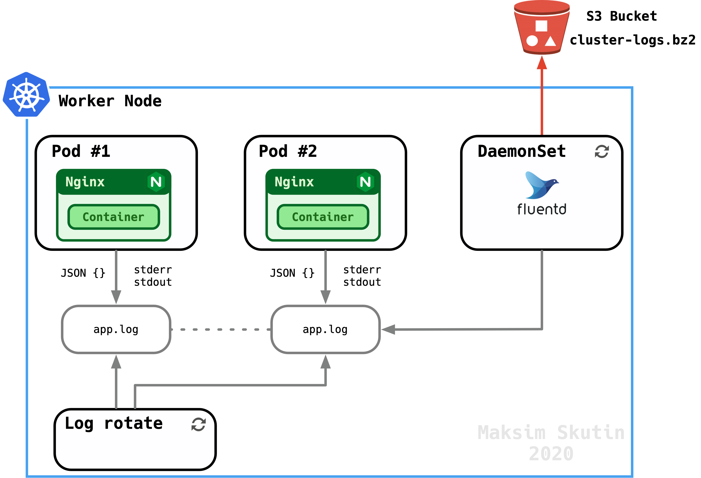

# Nginx Fluentd
Repository comprises two standalone solutions, both run containerized nginx application with custom html page. Nginx produces structured json logs which are being captured by another containerized service Fluentd.
- [Nginx Fluentd](#nginx-fluentd)
  - [Pre-requisuites](#pre-requisuites)
  - [Usage](#usage)
    - [Docker](#docker)
    - [Kubernetes](#kubernetes)
      - [Fluentd](#fluentd)
        - [RBAC](#rbac)
        - [DaemonSet](#daemonset)
      - [Nginx](#nginx)
      - [Logs](#logs)
  - [Task](#task)
    - [Description](#description)
    - [Notes](#notes)

## Pre-requisuites

Solutions have been tested on the following stack:

- Mac OS X 10.15.5
- docker 19.03
- docker-compose 1.25.5
- minikube 1.12.0
- logging driver - [fluentd-async-logger](https://github.com/akerouanton/fluentd-async-logger) 0.2

## Usage

### Docker

The solution is based on fluentd docker logging driver. Nginx and Fluentd services are defined in `docker-compose.yml`.

>Due to [#40063](https://github.com/moby/moby/issues/40063) nginx service uses nonofficial Fluentd logging driver for Docker.

```bash
docker plugin install --alias fluentd-async akerouanton/fluentd-async-logger:v0.2
Plugin "akerouanton/fluentd-async-logger:v0.2" is requesting the following privileges:
 - network: [host]
Do you grant the above permissions? [y/N] y
v0.2: Pulling from akerouanton/fluentd-async-logger
a59fdf9ef651: Download complete
Digest: sha256:af45627630a592ec635dca5866abadb6db5e9c410dab51187bb59bbdb61bf427
Status: Downloaded newer image for akerouanton/fluentd-async-logger:v0.2
Installed plugin akerouanton/fluentd-async-logger:v0.2
```

To run this solution simply execute: `docker-compose up --build -d`
<details>
  <summary>output</summary>

```bash
Creating network "nginx-fluentd_default" with the default driver
Building fluentd
Step 1/2 : FROM fluent/fluentd:v1.11.0-1.0
 ---> 99ad15281955
Step 2/2 : COPY fluent.conf /fluentd/etc
 ---> Using cache
 ---> 6bc15fdf3710

Successfully built 6bc15fdf3710
Successfully tagged nginx-fluentd_fluentd:latest
Building nginx
Step 1/3 : FROM nginx:latest
latest: Pulling from library/nginx
8559a31e96f4: Pull complete
1cf27aa8120b: Pull complete
67d252a8c1e1: Pull complete
9c2b660fcff6: Pull complete
4584011f2cd1: Pull complete
Digest: sha256:a93c8a0b0974c967aebe868a186e5c205f4d3bcb5423a56559f2f9599074bbcd
Status: Downloaded newer image for nginx:latest
 ---> 0901fa9da894
Step 2/3 : COPY index.html /var/www/index.html
 ---> f3d832bf9bd3
Step 3/3 : COPY nginx.conf /etc/nginx/nginx.conf
 ---> 82a114919b72

Successfully built 82a114919b72
Successfully tagged nginx-fluentd_nginx:latest
Creating nginx-fluentd_fluentd_1 ... done
Creating nginx-fluentd_nginx_1   ... done
```

</details>

Generate some logs:

```bash
$ curl -I 0.0.0.0:10080

HTTP/1.1 200 OK
Server: nginx/1.19.1
Date: Sun, 12 Jul 2020 13:04:16 GMT
Content-Type: text/html
Content-Length: 497
Last-Modified: Sun, 12 Jul 2020 06:38:50 GMT
Connection: keep-alive
ETag: "5f0aaffa-1f1"
X-Request-ID: 9b74d1b2c931269730141352bf054fa7
Accept-Ranges: bytes
```

```bash
 docker-compose logs --tai=5 fluentd | grep '9b74d1b2c931269730141352bf054fa7'
 ```

<details>
<summary>output</summary>

```bash
fluentd_1  | 2020-07-12 13:04:16.575066900 +0000 docker.nginx: {"container_name":"/nginx-fluentd_nginx_1","source":"stdout","log":"{\"msec\": \"1594559056.570\", \"connection\": \"1\", \"connection_requests\": \"1\", \"pid\": \"28\", \"request_id\": \"9b74d1b2c931269730141352bf054fa7\", \"request_length\": \"78\", \"remote_addr\": \"172.21.0.1\", \"remote_user\": \"\", \"remote_port\": \"40848\", \"time_local\": \"12/Jul/2020:13:04:16 +0000\", \"time_iso8601\": \"2020-07-12T13:04:16+00:00\", \"request\": \"HEAD / HTTP/1.1\", \"request_uri\": \"/\", \"args\": \"\", \"status\": \"200\", \"body_bytes_sent\": \"0\", \"bytes_sent\": \"286\", \"http_referer\": \"\", \"http_user_agent\": \"curl/7.64.1\", \"http_x_forwarded_for\": \"\", \"http_host\": \"0.0.0.0:10080\", \"server_name\": \"\", \"request_time\": \"0.000\", \"upstream\": \"\", \"upstream_connect_time\": \"\", \"upstream_header_time\": \"\", \"upstream_response_time\": \"\", \"upstream_response_length\": \"\", \"upstream_cache_status\": \"\", \"ssl_protocol\": \"\", \"ssl_cipher\": \"\", \"scheme\": \"http\", \"request_method\": \"HEAD\", \"server_protocol\": \"HTTP/1.1\", \"pipe\": \".\", \"gzip_ratio\": \"\", \"http_cf_ray\": \"\"}","container_id":"6a1d51539eb4c859aaaccfc51f508425fc4da8336587c8ec92839fb994f16670","msec":"1594559056.570","connection":"1","connection_requests":"1","pid":"28","request_id":"9b74d1b2c931269730141352bf054fa7","request_length":"78","remote_addr":"172.21.0.1","remote_user":"","remote_port":"40848","time_local":"12/Jul/2020:13:04:16 +0000","time_iso8601":"2020-07-12T13:04:16+00:00","request":"HEAD / HTTP/1.1","request_uri":"/","args":"","status":"200","body_bytes_sent":"0","bytes_sent":"286","http_referer":"","http_user_agent":"curl/7.64.1","http_x_forwarded_for":"","http_host":"0.0.0.0:10080","server_name":"","request_time":"0.000","upstream":"","upstream_connect_time":"","upstream_header_time":"","upstream_response_time":"","upstream_response_length":"","upstream_cache_status":"","ssl_protocol":"","ssl_cipher":"","scheme":"http","request_method":"HEAD","server_protocol":"HTTP/1.1","pipe":".","gzip_ratio":"","http_cf_ray":""}
```
</details>

### Kubernetes

Kubernetes natively streams stdout/stderr logs for every container automatically.

The solution is based on [Fluentd DeameonSet](https://github.com/fluent/fluentd-kubernetes-daemonset/tree/master/docker-image/v1.11/debian-s3) and [out_s3](https://docs.fluentd.org/output/s3) fluentd plugin.



Start minikube:

```bash
$ minikube start --driver=virtualbox

😄  minikube v1.12.0 on Darwin 10.15.5
✨  Using the virtualbox driver based on user configuration
👍  Starting control plane node minikube in cluster minikube
🔥  Creating virtualbox VM (CPUs=2, Memory=4000MB, Disk=20000MB) ...
🐳  Preparing Kubernetes v1.18.3 on Docker 19.03.12 ...
🔎  Verifying Kubernetes components...
🌟  Enabled addons: default-storageclass, storage-provisioner
🏄  Done! kubectl is now configured to use "minikube"
```

#### Fluentd

##### RBAC

Configure RBAC (role-based access control) permissions so that Fluentd can access the appropriate components.

```bash
$ kubectl create -f fluentd/fluentd.rbac.yaml

serviceaccount/fluentd created
clusterrole.rbac.authorization.k8s.io/fluentd created
clusterrolebinding.rbac.authorization.k8s.io/fluentd created
```

ClusterRole grants get, list, and watch permissions on pods and namespace objects. The ClusterRoleBinding then binds the ClusterRole to the ServiceAccount within the kube-system namespace.

##### DaemonSet

Since we are going to use S3 as a storage, we need to create or use an existing S3 bucket.

Create S3 bucket:

*Option 1* - Pulumi

IaC project, along with corresponding [instructions](infra/README.md) is available in `infra` directory.

*Option 2* - AWS CLI

```bash
export S3_BUCKET_NAME=nginx-fluentd-logs-asia
export S3_AWS_REGION=ap-southeast-1
aws s3api create-bucket \
    --bucket "${S3_BUCKET_NAME}" \
    --create-bucket-configuration LocationConstraint="$>{S3_AWS_REGION}"
```

Once s3 bucket is created, we need to update DaemonSet object with its particulars, we also need to provide credentials to access the bucket. In production normally IAM Role and instance profile are being used.

Modify daemon set object `fluentd/fluentd.daemonset.yaml`:

```yaml
env:
    - name: S3_BUCKET_REGION
    value: REPLACEME
    - name: S3_BUCKET_NAME
    value: REPLACEME
    - name: AWS_ACCESS_KEY_ID
    value: REPLACEME
    - name: AWS_SECRET_ACCESS_KEY
    value: REPLACEME
```

Create Fluentd DaemonSet:

```bash
$ kubectl create -f fluentd/fluentd.daemonset.yaml

daemonset.apps/fluentd created
```

Check daemonset readyness:

```bash
$ kubectl get daemonset --namespace=kube-system

NAME         DESIRED   CURRENT   READY   UP-TO-DATE   AVAILABLE   NODE SELECTOR            AGE
fluentd      1         1         1       1            1           <none>                   1m43s
```

#### Nginx

In order to be able to create deployment for our nginx image we need to build it first:

Set docker to work with minikube docker daemon:

```bash
eval $(minikube -p minikube docker-env)
```

Build image:

```bash
docker-compose build
```

Create nginx deployment and expose it via service object:

```bash
$ kubectl create -f nginx/nginx-custom.yaml

deployment.apps/nginx created
service/nginx created
```

Check deployment and service statuses:

```bash
$ kubectl get deployments

NAME    READY   UP-TO-DATE   AVAILABLE   AGE
nginx   1/1     1            1           39s

$ kubectl get services nginx
NAME    TYPE       CLUSTER-IP     EXTERNAL-IP   PORT(S)           AGE
nginx   NodePort   10.96.252.56   <none>        10080:32617/TCP   109s
```

> Make sure that:
> - the pods `ImagePullPolicy` is set to `Never`
> - Image name is matching

#### Logs

Once nginx deployment status is ready and service is exposed we can generate some logs:
```bash
$ curl -I $(minikube ip):$(kubectl get --namespace default -o jsonpath="{.spec.ports[0].nodePort}" services nginx)

HTTP/1.1 200 OK
Server: nginx/1.19.1
Date: Sun, 12 Jul 2020 12:27:40 GMT
Content-Type: text/html
Content-Length: 497
Last-Modified: Sat, 11 Jul 2020 11:32:46 GMT
Connection: keep-alive
ETag: "5f09a35e-1f1"
X-Request-ID: e384c5eb2dc9543ecc0beddf7452b8ae
Accept-Ranges: bytes
```

`X-Request-ID` header that we set in `nginx/nginx.conf` is appended by nginx to every request made to the server, it is used to trace our requests in the wild:

```bash
$ kubectl logs  deployment/nginx | grep 'e384c5eb2dc9543ecc0beddf7452b8ae'

{"msec": "1594556860.043", "connection": "3", "connection_requests": "1", "pid": "28", "request_id": "e384c5eb2dc9543ecc0beddf7452b8ae", "request_length": "85", "remote_addr": "172.17.0.1", "remote_user": "", "remote_port": "1541", "time_local": "12/Jul/2020:12:27:40 +0000", "time_iso8601": "2020-07-12T12:27:40+00:00", "request": "HEAD / HTTP/1.1", "request_uri": "/", "args": "", "status": "200", "body_bytes_sent": "0", "bytes_sent": "286", "http_referer": "", "http_user_agent": "curl/7.64.1", "http_x_forwarded_for": "", "http_host": "192.168.99.100:32617", "server_name": "", "request_time": "0.000", "upstream": "", "upstream_connect_time": "", "upstream_header_time": "", "upstream_response_time": "", "upstream_response_length": "", "upstream_cache_status": "", "ssl_protocol": "", "ssl_cipher": "", "scheme": "http", "request_method": "HEAD", "server_protocol": "HTTP/1.1", "pipe": ".", "gzip_ratio": "", "http_cf_ray": ""}
```

> By default fluentd sends compressed logs to s3 bucket every 1 hour.
> Behaviour can be customised in `fluent.conf`.

Let's pull all logs from remote and use gunzip to uncompress them:

```bash
aws s3 sync s3://nginx-fluentd-logs-asia logs
```

Unzip:

```bash
find . -name '*.gz' -exec  gunzip {} \;
```

```bash
grep '9a3aca55572ae97bb8a128835df1c540' -RH logs
```
<details>
  <summary>output</summary>

```bash
logs/2020/07/12/cluster-log-2:2020-07-12T06:43:46+00:00	kubernetes.var.log.containers.nginx-6bf67d55f7-7lr7z_default_nginx-d66b216744d6d4f7c94d1becc000a748495fab891e0f2f87c541a170b18405cf.log	{"log":"{\"msec\": \"1594536226.454\", \"connection\": \"6\", \"connection_requests\": \"10\", \"pid\": \"30\", \"request_id\": \"9a3aca55572ae97bb8a128835df1c540\", \"request_length\": \"452\", \"remote_addr\": \"172.17.0.1\", \"remote_user\": \"\", \"remote_port\": \"21271\", \"time_local\": \"12/Jul/2020:06:43:46 +0000\", \"time_iso8601\": \"2020-07-12T06:43:46+00:00\", \"request\": \"GET / HTTP/1.1\", \"request_uri\": \"/\", \"args\": \"\", \"status\": \"304\", \"body_bytes_sent\": 
\"0\", \"bytes_sent\": \"180\", \"http_referer\": \"\", \"http_user_agent\": \"Mozilla/5.0 (Macintosh; Intel Mac OS X 10.15; rv:78.0) Gecko/20100101 Firefox/78.0\", \"http_x_forwarded_for\": \"\", \"http_host\": \"192.168.99.100:32699\", \"server_name\": \"\", \"request_time\": \"0.000\", \"upstream\": \"\", \"upstream_connect_time\": \"\", \"upstream_header_time\": \"\", \"upstream_response_time\": \"\", \"upstream_response_length\": \"\", \"upstream_cache_status\": \"\", \"ssl_protocol\": \"\", \"ssl_cipher\": \"\", \"scheme\": \"http\", \"request_method\": \"GET\", \"server_protocol\": \"HTTP/1.1\", \"pipe\": \".\", \"gzip_ratio\": \"\", \"http_cf_ray\": \"\"}\n","stream":"stdout","docker":{"container_id":"d66b216744d6d4f7c94d1becc000a748495fab891e0f2f87c541a170b18405cf"},"kubernetes":{"container_name":"nginx","namespace_name":"default","pod_name":"nginx-6bf67d55f7-7lr7z","container_image":"nginx-fluentd_nginx:latest","container_image_id":"docker://sha256:2257d9d465c37b4f2f3db70bfd7d2d89b5bbd4b222dde681c049d3378f2f38c0","pod_id":"c95c77e5-9533-473a-8b20-88b326a64067","host":"minikube","labels":{"pod-template-hash":"6bf67d55f7","io_kompose_service":"nginx"},"master_url":"https://10.96.0.1:443/api","namespace_id":"8efa9651-eed2-40c4-9ba8-f56a735de65d"},"tag":"kubernetes.var.log.containers.nginx-6bf67d55f7-7lr7z_default_nginx-d66b216744d6d4f7c94d1becc000a748495fab891e0f2f87c541a170b18405cf.log","time":1594536226.45533}
```

</details>

## Task

### Description

- [x] Deploy a Dockerized application serving a static website via (e.g. via Nginx) that displays a custom welcome page (but not the default page for the web server used)
  - Nginx serves custom static asset `nginx/index.html`
  - Nginx default logging configuration has been customized in favour of structured logging using json format. `nginx/nginx.conf`
  - Nginx access logs are traceable via `X-Request-ID`
- [x] Use fluentd to ship Nginx request logs to an output of your choice (e.g. S3, ElasticSearch)
  - docker: [out_stdout](https://docs.fluentd.org/output/stdout) at `fluentd/fluent.conf`
  - k8s: [out_s3](https://docs.fluentd.org/output/s3) built-in defaults
- [x] Provide a standalone solution including both webapp and fluentd using docker-compose and/or a kubernetes deployment (plain manifest or helm chart)
  - docker
    - `docker-compose.yml`
  - k8s
    - `fluentd.rbac.yaml`
    - `fluentd.daemonset.yaml`
    - `nginx-custom.yaml`

### Notes

- [x]  Avoid running multiple services in single container
- [x]  You can use any 3rd party Docker image (you might have to explain your choice)
- [x]  Bonus: use an IAC tool of your choice to create cloud resources you may need (e.g. S3 buckets)
  - `awscli` is used to create s3 bucket, while IaC tool is an overkill for such trivial thing pulumi project has been created for the sake of this task anyway.
